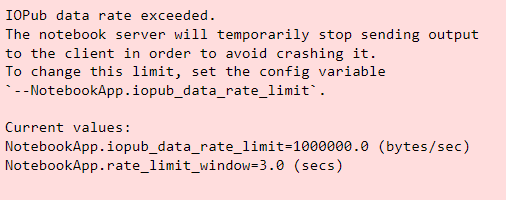

<h1>FSDS exercise</h1><hr/> 
<p>Please open the jupyter notebook by following command; <strong>if it is needed to execute.</strong>Because script requires more resource than default.</p>

```shell
    jupyter notebook --NotebookApp.iopub_data_rate_limit=1e10
```

instead of

```shell
    jupyter notebook
```
<p>if this notebook executes on default jupyter notebook environment. then it will notice following message and interrupt the execution.</p>
